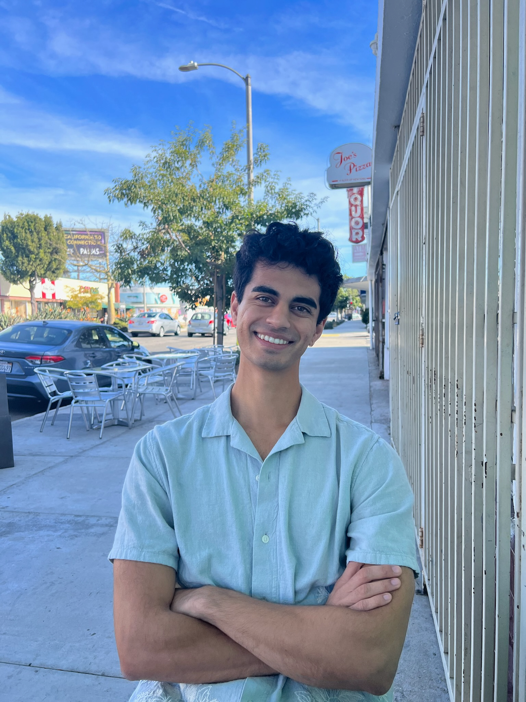

  

Hello! I'm currently a Machine Learning Engineer based in California. In 2022, I graduated with a B.S. in applied math and a minor in neuroscience at UCLA. At UCLA, I was a research assistant in the [Buonomano Lab](http://buonomanolab.com), where I trained recurrent neural networks (RNNs) to perform timing and short-term memory tasks and analyzed the dynamics of the trained networks. 

Here are links to my [Github](https://github.com/rehanbchinoy), [LinkedIn](https://www.linkedin.com/in/rehan-chinoy-37420911b/). You can get in touch via [email](mailto:rehanbchinoy@gmail.com).
